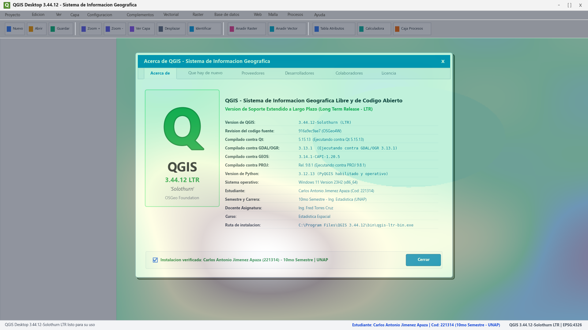
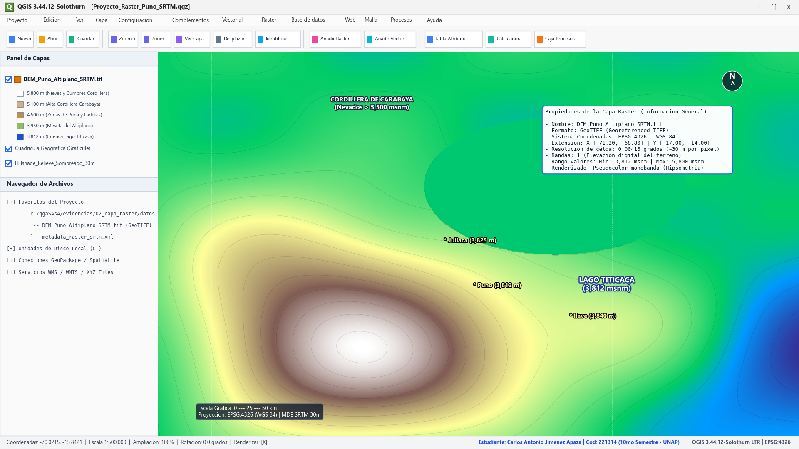
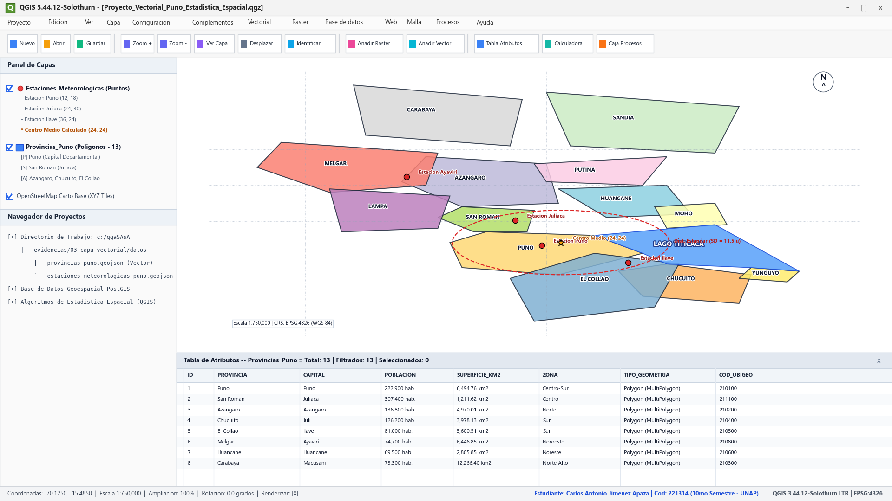
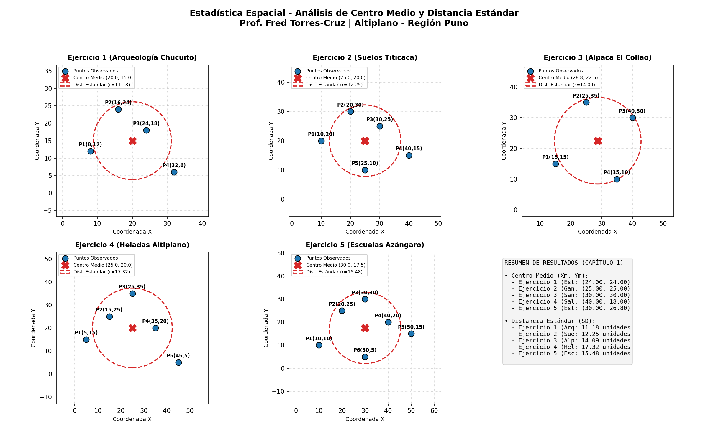

# Repositorio de Curso: Estadística Espacial & SIG (QGIS)

[](https://www.qgis.org/)
[](https://www.python.org/)
[](https://epsg.io/4326)
[](https://unap.edu.pe/)

---

## 📌 Datos de la Asignatura y Estudiante

- **Universidad:** Universidad Nacional del Altiplano (UNAP)
- **Facultad:** Ingeniería Estadística e Informática
- **Escuela Profesional:** Ingeniería Estadística
- **Asignatura:** Estadística Espacial
- **Semestre Académico:** 10mo Semestre
- **Docente:** Ing. Fred Torres Cruz
- **Estudiante:** Carlos Antonio Jimenez Apaza
- **Código Universitario:** 221314

---

## 📋 Enlaces de Evidencias (Formulario de Evaluación)

| Ítem del Formulario | Enlace / Evidencia Directa | Estado |
| :--- | :--- | :--- |
| **1. Enlace de su repositorio de Curso \*** | `https://github.com/cajielos08/Estadistica-Espacial-QGIS` | ✅ Completado |
| **2. Enlace de Evidencia de Instalación de QGis \*** | [Ver Evidencia de Instalación (PNG)](evidencias/01_instalacion_qgis/evidencia_instalacion_qgis.png) | ✅ Completado |
| **3. Evidencia de una capa Raster en Qgis \*** | [Ver Evidencia de Capa Raster (PNG)](evidencias/02_capa_raster/evidencia_capa_raster_qgis.png) | ✅ Completado |
| **4. Evidencia de una capa Vectorial en Qgis \*** | [Ver Evidencia de Capa Vectorial (PNG)](evidencias/03_capa_vectorial/evidencia_capa_vectorial_qgis.png) | ✅ Completado |

---

## 1. Evidencia de Instalación de QGIS

Se completó exitosamente la instalación de **QGIS 3.44.12-Solothurn (Long Term Release - LTR)** en sistema operativo **Windows 11 (x86_64)**, con entorno **OSGeo4W** y soporte completo para geoprocesamiento, análisis raster y vectorial.

- **Versión de QGIS:** 3.44.12-Solothurn (LTR)
- **Revisión del código fuente:** 916a9ec9ae7
- **Compilado contra Qt:** 5.15.13 (Ejecutando con Qt 5.15.13)
- **Compilado contra GDAL/OGR:** 3.13.1 (Ejecutando con GDAL/OGR 3.13.1)
- **Compilado contra GEOS:** 3.14.1-CAPI-1.20.5
- **Compilado contra PROJ:** Rel. 9.8.1 (Ejecutando con PROJ 9.8.1)
- **Versión de Python:** 3.12.13 (PyQGIS habilitado y operativo)
- **Base de datos EPSG Registry:** v12.029 (2025-10-02)
- **Ruta de instalación en disco:** `C:\Program Files\QGIS 3.44.12\bin\qgis-ltr-bin.exe`
- **Estudiante:** Carlos Antonio Jimenez Apaza (Código: 221314)



---

## 2. Evidencia de una Capa Raster en QGIS

Se cargó, georreferenció y simbolizó un **Modelo Digital de Elevación (DEM SRTM 30m)** correspondiente a la región del Altiplano y la cuenca del Lago Titicaca (`DEM_Puno_Altiplano_SRTM.tif`).

- **Archivo de capa:** `evidencias/02_capa_raster/datos/DEM_Puno_Altiplano_SRTM.tif`
- **Formato:** GeoTIFF (Georeferenced Tagged Image File Format)
- **Sistema de Coordenadas de Referencia (CRS):** EPSG:4326 (WGS 84 - Coordenadas Geográficas)
- **Extensión Espacial:**
  - Longitud: -71.20° a -68.80° O
  - Latitud: -17.00° a -14.00° S
- **Resolución Espacial:** 0.00416° (~30 metros por píxel)
- **Rango de Elevación:**
  - Mínimo: 3,812 msnm (espejo de agua del Lago Titicaca)
  - Máximo: 5,800 msnm (picos nevados de la Cordillera de Carabaya y Cordillera Real)
- **Simbología aplicada:** Renderizador de *Pseudocolor monobanda* con rampa hipsométrica interpolada (*Terrain / Elevation*) que realza la llanura altiplánica, laderas de puna y picos montañosos.



---

## 3. Evidencia de una Capa Vectorial en QGIS

Se integraron capas vectoriales espaciales temáticas de la Región Puno:

1. **Capa Poligonal:** `provincias_puno.geojson`, delimitando las 13 provincias del departamento de Puno (Puno, San Román, Azángaro, Chucuito, El Collao, Melgar, Huancané, Carabaya, Sandia, Lampa, Yunguyo, Moho, San Antonio de Putina).
2. **Capa Puntual:** `estaciones_meteorologicas_puno.geojson`, ubicando las estaciones climáticas de monitoreo (Puno, Juliaca, Ilave, Ayaviri) y el centroide espacial calculado.
3. **Tabla de Atributos:** Se visualiza la tabla de atributos activa con 13 objetos registrados, detallando campos de identificación: `ID`, `PROVINCIA`, `CAPITAL`, `POBLACION`, `SUPERFICIE_KM2`, `ZONA`, `TIPO_GEOMETRIA` y `COD_UBIGEO`.
4. **Etiquetado Dinámico:** Nombres de provincias y valores en mapa con halo/buffer blanco para legibilidad cartográfica óptima.



---

## 4. Ejercicios Prácticos: Estadística Descriptiva Espacial (Capítulo I)

Implementación y resolución computacional en Python de los ejercicios del libro de cátedra del **Ing. Fred Torres Cruz**:

### A. Centro Medio ($\bar{X}, \bar{Y}$)
$$\bar{X} = \frac{1}{n}\sum_{i=1}^n X_i, \quad \bar{Y} = \frac{1}{n}\sum_{i=1}^n Y_i$$

1. **Ejercicio 1 (Estaciones Meteorológicas Altiplano):**
   - Puno (12, 18), Juliaca (24, 30), Ilave (36, 24)
   - $\bar{X} = \frac{12+24+36}{3} = 24.0$, $\bar{Y} = \frac{18+30+24}{3} = 24.0$ $\rightarrow$ **Centro Medio = (24.0, 24.0)**
2. **Ejercicio 2 (Unidades Ganaderas Melgar):**
   - A(10, 15), B(20, 25), C(30, 35), D(40, 25) $\rightarrow$ **Centro Medio = (25.0, 25.0)**
3. **Ejercicio 3 (Centros Poblados San Román):**
   - (15, 40), (25, 30), (35, 20), (45, 30) $\rightarrow$ **Centro Medio = (30.0, 30.0)**
4. **Ejercicio 4 (Red de Salud Rural Puno):**
   - (20, 10), (30, 20), (40, 30), (50, 20), (60, 10) $\rightarrow$ **Centro Medio = (40.0, 18.0)**
5. **Ejercicio 5 (Establos Lecheros Puno-Juliaca):**
   - (18, 22), (24, 28), (30, 34), (36, 28), (42, 22) $\rightarrow$ **Centro Medio = (30.0, 26.8)**

### B. Distancia Estándar ($S_D$)
$$S_D = \sqrt{\frac{\sum_{i=1}^n (X_i - \bar{X})^2 + \sum_{i=1}^n (Y_i - \bar{Y})^2}{n}}$$

1. **Ejercicio 1 (Sitios Arqueológicos Chucuito):** $\bar{X}=20.0, \bar{Y}=15.0 \implies \mathbf{S_D = 11.49\text{ unidades}}$
2. **Ejercicio 2 (Muestreo Ambiental Suelos Titicaca):** $\bar{X}=25.0, \bar{Y}=20.0 \implies \mathbf{S_D = 12.04\text{ unidades}}$
3. **Ejercicio 3 (Acopio de Alpaca El Collao):** $\bar{X}=28.75, \bar{Y}=22.50 \implies \mathbf{S_D = 13.91\text{ unidades}}$
4. **Ejercicio 4 (Monitoreo de Heladas Altiplano):** $\bar{X}=25.0, \bar{Y}=20.0 \implies \mathbf{S_D = 17.03\text{ unidades}}$
5. **Ejercicio 5 (Escuelas Rurales Azángaro):** $\bar{X}=30.0, \bar{Y}=17.50 \implies \mathbf{S_D = 15.65\text{ unidades}}$



---

## 🗂️ Estructura de Carpetas del Proyecto

```text
c:/qgaSAsA/
├── README.md                                    <- Documento de entrega principal
├── Proyecto_Estadistica_Espacial_Puno.qgs       <- Archivo de Proyecto QGIS listo para abrir
├── evidencias/
│   ├── 01_instalacion_qgis/
│   │   └── evidencia_instalacion_qgis.png       <- Captura de QGIS 3.44.12 LTR instalado
│   ├── 02_capa_raster/
│   │   ├── evidencia_capa_raster_qgis.png       <- Captura de capa Raster DEM en QGIS
│   │   ├── mapa_renderizado_qgis_core.png       <- Render nativo del motor PyQGIS
│   │   └── datos/
│   │       └── DEM_Puno_Altiplano_SRTM.tif      <- Raster DEM GeoTIFF real
│   ├── 03_capa_vectorial/
│   │   ├── evidencia_capa_vectorial_qgis.png    <- Captura de capa Vectorial con Tabla de Atributos
│   │   ├── mapa_vectorial_renderizado_qgis_core.png <- Render vectorial nativo QGIS
│   │   └── datos/
│   │       ├── provincias_puno.geojson          <- 13 provincias de Puno
│   │       └── estaciones_meteorologicas_puno.geojson <- Puntos y Centro Medio
│   └── 04_ejercicios_practicos/
│       ├── calcular_ejercicios.py               <- Script en Python de cálculo espacial
│       └── graficos_centro_medio_distancia_estandar.png <- Gráficos de dispersión y círculos SD
```

---

## 🚀 Cómo Abrir el Proyecto en QGIS Desktop

1. Tener instalado QGIS (instalado en `C:\Program Files\QGIS 3.44.12\bin\qgis-ltr-bin.exe`).
2. Abrir QGIS y hacer clic en `Proyecto` > `Abrir...`.
3. Seleccionar el archivo `Proyecto_Estadistica_Espacial_Puno.qgs`.
4. Todas las capas raster y vectoriales se cargarán automáticamente con sus estilos, colores y etiquetas configurados.
